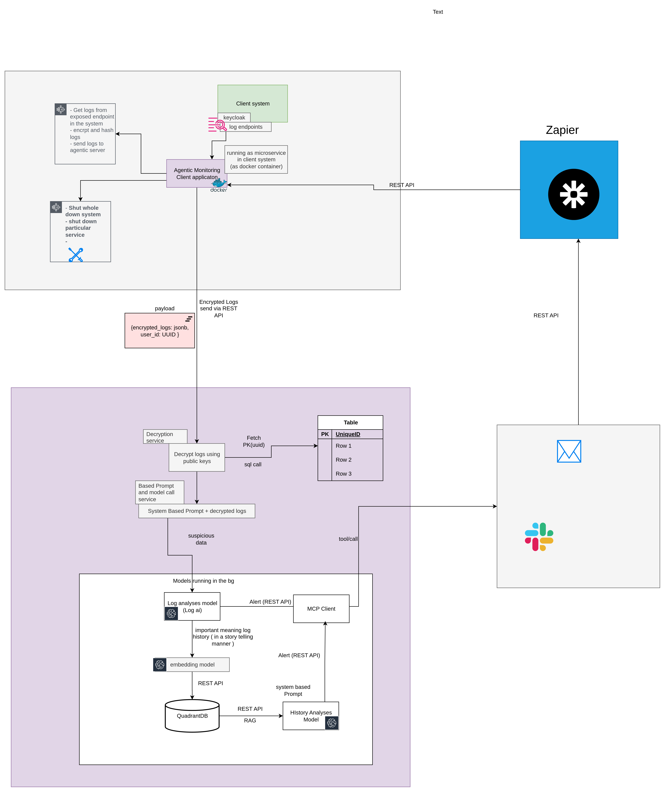

# LogNarrator: Contextual Log Analysis with Intelligent Response



## 🏆 Hack-Nation25 | Agentic AI & Data Engineering Track

A next-generation log analysis system that goes beyond traditional monitoring by combining privacy-first architecture with contextual intelligence and automated response capabilities.

## 📊 Project Overview

LogNarrator is built for the [Hack-Nation 25](https://hack-nation.ai/) competition in the `Agentic AI & Data Engineering` track. Unlike conventional log analysis solutions like Datadog or Grafana, LogNarrator focuses on extracting meaningful narratives from logs to detect anomalies in context and trigger appropriate automated responses.

## 🚀 Getting Started

### Prerequisites

- Docker & Docker Compose
- Rust (for client development)
- Go (for collector development)
- Python 3.10+ (for cloud development)

### Quick Start

```bash
# Clone the repository
git clone https://github.com/your-org/lognarrator.git
cd lognarrator

# Set up development environment
make setup

# Build the project
make build

# Start services
make run
```

The API will be available at http://localhost:8000, and the documentation at http://localhost:8000/docs.

### Project Structure

```
├── docs/                 # Documentation
├── src/                  # Source code
│   ├── client/           # Client-side components
│   │   ├── rust/         # Rust MCP client
│   │   ├── go/           # Go log collector
│   │   ├── config/       # Client configuration
│   │   └── Dockerfile    # Client container definition
│   ├── cloud/            # Cloud-side components
│   │   ├── api/          # FastAPI application
│   │   └── Dockerfile    # Cloud container definition
├── docker-compose.yml    # Local development environment
├── Makefile              # Build and development commands
└── README.md             # This file
```

## 🌟 Key Features

### 1. Narrative Intelligence
- **Beyond Pattern Matching**: Traditional tools detect anomalies based on static thresholds or simple patterns. LogNarrator builds contextual stories from log sequences.
- **Temporal Context Understanding**: Recognizes that today's logs make sense only in the context of yesterday's events.
- **Root Cause Storytelling**: Doesn't just alert on anomalies but explains them in a human-readable narrative that speeds troubleshooting.

### 2. Privacy-First Architecture
- **Local-First Processing**: Runs as a secure Docker container within the client's infrastructure.
- **End-to-End Encryption**: All logs are encrypted before leaving the client's environment.
- **Minimized Data Exposure**: Even during cloud processing, logs are only decrypted within secure analysis environments.

### 3. Intelligent Action Framework
- **MCP Integration**: Directly connects insights to the Multi-Command Protocol for automated response.
- **Remediation Recommendations**: Suggests specific actions based on historical successful resolutions.
- **Feedback Loop**: Learns from the effectiveness of triggered actions to improve future recommendations.

## 🔧 Technology Stack

### Client-Side Components

| Component | Technology | Purpose |
|-----------|------------|----------|
| Container Runtime | Docker | Isolated, portable deployment |
| Log Collection | OpenTelemetry Collector | Standard, extensible log ingestion |
| Encryption | libsodium | Public/private key cryptography |
| MCP Client | Custom Rust implementation | Action execution framework |
| Local Cache | SQLite | Offline operation capability |

### Cloud Components

| Component | Technology | Purpose |
|-----------|------------|----------|
| API Gateway | FastAPI (Python) | Secure endpoint for log ingestion |
| User Management | PostgreSQL | Store user accounts and public keys |
| Secret Management | HashiCorp Vault | Secure key storage and rotation |
| Analysis Pipeline | Ray (distributed Python) | Scalable log processing |
| Anomaly Detection | LogAI / Anomalib | Base pattern recognition |
| Embedding Model | SentenceTransformers | Convert logs to vector space |
| Vector Database | Qdrant | Store contextual log patterns |
| Narrative Engine | LLM (e.g., Mistral 7B) | Generate explanatory narratives |

## 📝 Implementation Plan

See the detailed [Implementation Plan](docs/implementation.md) that breaks down the project into phases and sectors for your team of 3 developers.

## 🏛️ Architecture

For detailed architecture information, see the [Architecture Documentation](docs/architecture.md).

## 👥 Team Roles

- **Team Member A**: Client-side (Log Collection, Encryption, MCP Client)
- **Team Member B**: Cloud-side API/Processing (API Layer, Pipeline, Vector DB)
- **Team Member C**: Integration, Security, DevOps (Orchestration, Secrets, Auth, CI/CD)

## 📜 License

This project is licensed under the MIT License - see the [LICENSE](LICENSE) file for details.