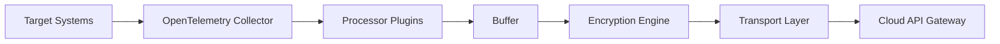
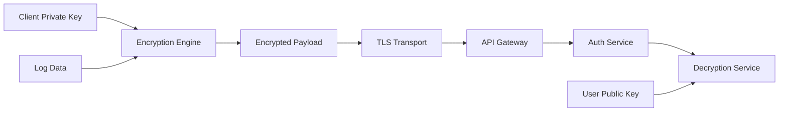
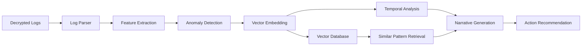
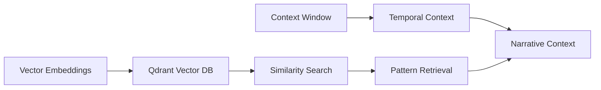
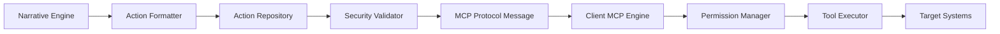

# LogNarrator: Technology Stack

## Overview

LogNarrator's technology stack is designed with the following principles:

1. **Security-First**: Every component is built with security as a core requirement
2. **Scalability**: Ability to handle massive log volumes across distributed systems
3. **Modularity**: Pluggable components that can be replaced or extended
4. **Open Standards**: Leveraging established protocols and formats where possible
5. **Future-Proof**: Using technologies with strong community support and development

## Core Technology Stack

### Client-Side Technologies

| Component | Technology | Justification |
|-----------|------------|---------------|
| **Container Runtime** | Docker | Industry standard for containerization, broad compatibility with orchestration platforms, simplified deployment, and management. |
| **Log Collection** | OpenTelemetry Collector | Open-source, vendor-neutral, supports multiple data formats, extensive plugin ecosystem, actively maintained by CNCF. |
| **Language Runtime** | Rust | Memory safety, performance, and reliability for critical components like MCP client. |
| **Encryption** | libsodium | Modern, audited cryptographic library with high-level APIs that prevent common implementation errors. |
| **Local Storage** | SQLite | Embeddable, zero-configuration, reliable local storage without external dependencies. |
| **MCP Framework** | Custom Rust implementation | Purpose-built for secure command execution with fine-grained permissions and audit logging, leveraging Rust's memory safety and performance. |
| **Configuration** | YAML with schema validation | Human-readable, machine-validatable, supports comments and includes. |

### Cloud-Side Technologies

| Component | Technology | Justification |
|-----------|------------|---------------|
| **API Layer** | FastAPI (Python) | Modern, high-performance async framework with automatic OpenAPI documentation. |
| **Authentication** | OAuth 2.0 + JWT | Industry standard for secure, token-based authentication with support for MFA and RBAC. |
| **Container Orchestration** | Kubernetes | Industry standard for container orchestration, auto-scaling, and deployment management. |
| **Database (Relational)** | PostgreSQL | Robust, ACID-compliant database with advanced features (JSON, full-text search) and excellent performance. |
| **Secret Management** | HashiCorp Vault | Enterprise-grade secret management with key rotation, access control, and audit logging. |
| **Message Queue** | Apache Kafka | High-throughput, distributed messaging system for reliable log delivery and processing. |
| **Vector Database** | Qdrant | High-performance vector similarity search optimized for production use with filtering capabilities. |
| **Distributed Computing** | Ray | Python-based distributed computing framework that scales from laptop to cluster. |
| **Embeddings Model** | SentenceTransformers | State-of-the-art text embedding models with excellent performance characteristics. |
| **Language Model** | Mistral 7B / LLama 2 | Open-source foundation models with strong reasoning capabilities that can run in private environments. |

## Detailed Component Architecture

### 1. Log Collection & Processing

#### Key Technologies

- **OpenTelemetry Collector**: Core collection framework
- **OTLP Protocol**: Standard format for telemetry data
- **Fluent Bit**: Alternative lightweight collector for constrained environments
- **Protocol Buffers**: Efficient binary serialization

### 2. Encryption & Security

#### Key Technologies

- **libsodium**: Core cryptographic library
- **X25519**: Elliptic curve for key exchange
- **XChaCha20-Poly1305**: Authenticated encryption
- **TLS 1.3**: Transport security
- **HashiCorp Vault**: Key management

### 3. Analysis Pipeline

#### Key Technologies

- **Ray**: Distributed processing framework
- **LogAI**: Facebook's log analysis library
- **PyTorch**: Deep learning framework
- **SentenceTransformers**: Text embedding models
- **RAPIDS**: GPU-accelerated data processing
- **Mistral 7B**: Foundation language model
- **LangChain**: LLM orchestration framework

### 4. Vector Database & Knowledge Store

#### Key Technologies

- **Qdrant**: Production-ready vector database
- **HNSW Algorithm**: Approximate nearest neighbor search
- **PostgreSQL**: Metadata storage
- **TimescaleDB**: Time-series extensions (optional)

### 5. MCP Action Framework

#### Key Technologies

- **Protocol Buffers**: MCP message format
- **gRPC**: Communication protocol
- **Casbin**: Authorization framework
- **Temporal.io**: Workflow engine (optional)
- **OpenPolicyAgent**: Policy enforcement

## Infrastructure Technologies

### Development Infrastructure

| Component | Technology |
|-----------|------------|
| **Version Control** | Git + GitHub |
| **CI/CD** | GitHub Actions |
| **Dependency Management** | Poetry (Python), Go Modules, Cargo (Rust) |
| **Testing** | pytest, testify, k6, Rust test framework |
| **Documentation** | MkDocs, OpenAPI |
| **Code Quality** | Black, Golangci-lint, Clippy (Rust), SonarQube |

### Deployment Infrastructure

| Component | Technology |
|-----------|------------|
| **Container Registry** | Docker Hub / AWS ECR |
| **Orchestration** | Kubernetes |
| **Infrastructure as Code** | Terraform |
| **Configuration Management** | Helm Charts |
| **Secrets Management** | HashiCorp Vault |
| **Monitoring** | Prometheus + Grafana |
| **Logging** | ELK Stack / Loki |
| **Tracing** | Jaeger |

## Security Technologies

| Component | Technology |
|-----------|------------|
| **Authentication** | OAuth 2.0 + OIDC |
| **Authorization** | RBAC + Casbin |
| **Encryption (Data at Rest)** | AES-256-GCM |
| **Encryption (Data in Transit)** | TLS 1.3 |
| **Encryption (End-to-End)** | XChaCha20-Poly1305 |
| **Key Exchange** | X25519 |
| **Certificate Management** | cert-manager |
| **Vulnerability Scanning** | Trivy, Snyk |
| **Secret Detection** | git-secrets, Trufflehog |
| **SAST** | CodeQL, SonarQube |

## Performance Optimizations

### High-Volume Log Processing

- **Batch Processing**: Grouped log processing for efficiency
- **Streaming Architecture**: Kafka-based log streaming for backpressure handling
- **Resource-Aware Scaling**: Kubernetes HPA based on CPU, memory, and queue metrics
- **Caching**: Redis for frequent pattern caching
- **Indexing**: Optimized search indices for common query patterns

### Vector Search Optimization

- **Quantization**: Reduced vector precision for memory efficiency
- **HNSW Algorithm**: Hierarchical navigable small world graph for fast ANN search
- **Sharding**: Distributed vector storage for horizontal scaling
- **GPU Acceleration**: CUDA-based similarity search for high-performance environments

### Language Model Performance

- **Model Quantization**: 4-bit and 8-bit quantized models for reduced memory footprint
- **KV Caching**: Efficient token generation
- **Batched Inference**: Grouped processing of similar requests
- **Model Distillation**: Task-specific smaller models for narrative generation

## Technology Selection Criteria

Each technology in our stack was evaluated against the following criteria:

1. **Security**: Does it follow security best practices? Has it been audited?
2. **Performance**: Can it handle our scale requirements?
3. **Maintainability**: Is it well-documented and actively maintained?
4. **Community**: Does it have a healthy community and ecosystem?
5. **Licensing**: Is the licensing compatible with our business model?
6. **Maturity**: Is it stable enough for production use?
7. **Integration**: Does it work well with other components in our stack?

## Technology Roadmap

### Near-Term (Q3 2023)

- **Edge Processing**: Enhanced local processing capabilities
- **WASM Plugins**: WebAssembly-based extension system
- **ARM64 Support**: Optimized containers for ARM architecture

### Mid-Term (Q4 2023)

- **Graph Neural Networks**: Enhanced relationship analysis
- **Multi-Modal Support**: Image and metric data integration
- **eBPF Integration**: Kernel-level data collection

### Long-Term (2024)

- **Federated Learning**: Cross-organization model improvement
- **Hardware Acceleration**: FPGA-based log processing
- **Zero-Knowledge Proofs**: Enhanced privacy guarantees
