# LogNarrator: Workflow Documentation

## Core Workflows

This document details the primary workflows within the LogNarrator system, from log collection to automated response actions. These workflows illustrate how the system components interact to deliver the key value propositions.

## 1. System Setup & Onboarding

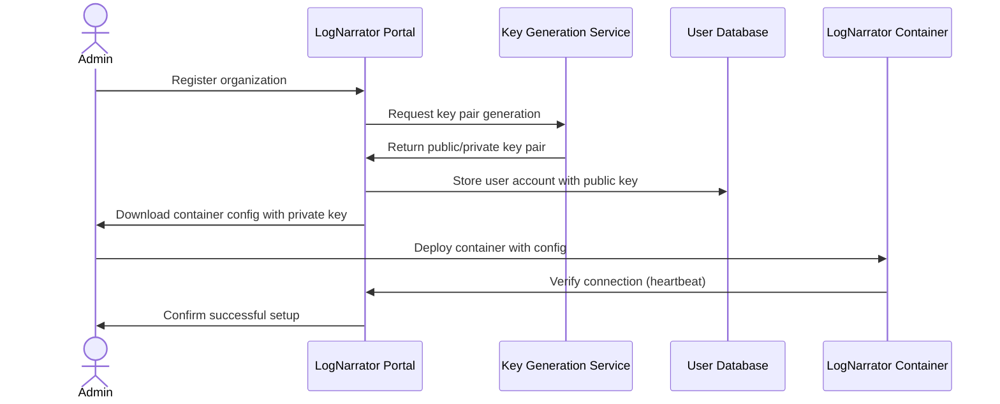

### Key Steps

1. **Organization Registration**
   - Administrator creates account on LogNarrator portal
   - Provides basic organization information
   - Selects deployment model (fully local, hybrid, managed)

2. **Security Configuration**
   - System generates unique asymmetric key pair
   - Private key embedded in container configuration
   - Public key stored in LogNarrator cloud for decryption

3. **Container Deployment**
   - Administrator downloads preconfigured container
   - Deploys container to target environment
   - Container establishes secure connection to LogNarrator cloud

4. **Integration Configuration**
   - Administrator configures log sources
   - Sets up MCP action permissions
   - Defines alert routing and notification preferences

## 2. Log Collection & Processing

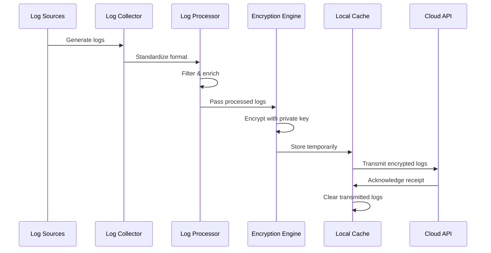

### Key Steps

1. **Log Collection**
   - OpenTelemetry collector ingests logs from configured sources
   - Sources can include files, syslog, journald, API endpoints, etc.
   - Collection occurs in real-time with configurable buffering

2. **Initial Processing**
   - Logs standardized to common format
   - Enrichment with metadata (hostname, service name, etc.)
   - Preliminary filtering to reduce noise

3. **Encryption**
   - Logs encrypted using client's private key
   - Each log batch includes client UUID for identification
   - Encrypted data cannot be read without client's public key

4. **Transmission**
   - Encrypted logs sent to LogNarrator cloud API
   - Secure TLS connection with certificate validation
   - Transmission throttled based on network conditions
   - Failed transmissions automatically retried with exponential backoff

## 3. Cloud-Side Analysis

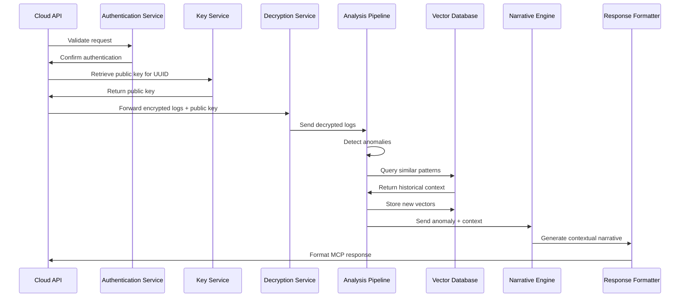

### Key Steps

1. **Authentication & Decryption**
   - Incoming request authenticated using JWT
   - Client UUID used to retrieve corresponding public key
   - Encrypted logs decrypted in secure, isolated environment
   - Decrypted logs never persistently stored

2. **Anomaly Detection**
   - Initial analysis using LogAI or similar technology
   - Pattern recognition across multi-dimensional log features
   - Statistical anomaly detection for unexpected behaviors
   - Threshold-based alerting for critical conditions

3. **Contextual Analysis**
   - Anomalous log sequences converted to vector embeddings
   - Similar historical patterns retrieved from vector database
   - Temporal context established across multiple time windows
   - Cross-service relationships identified

4. **Narrative Generation**
   - Language model (e.g., Mistral 7B) interprets anomaly in context
   - Generates human-readable explanation of the issue
   - Identifies potential root causes based on similar patterns
   - Suggests appropriate remediation actions

5. **Response Formatting**
   - Structures analysis results in MCP-compatible format
   - Includes severity classification
   - Provides structured action recommendations
   - Packages context information for troubleshooting

## 4. MCP Action Execution

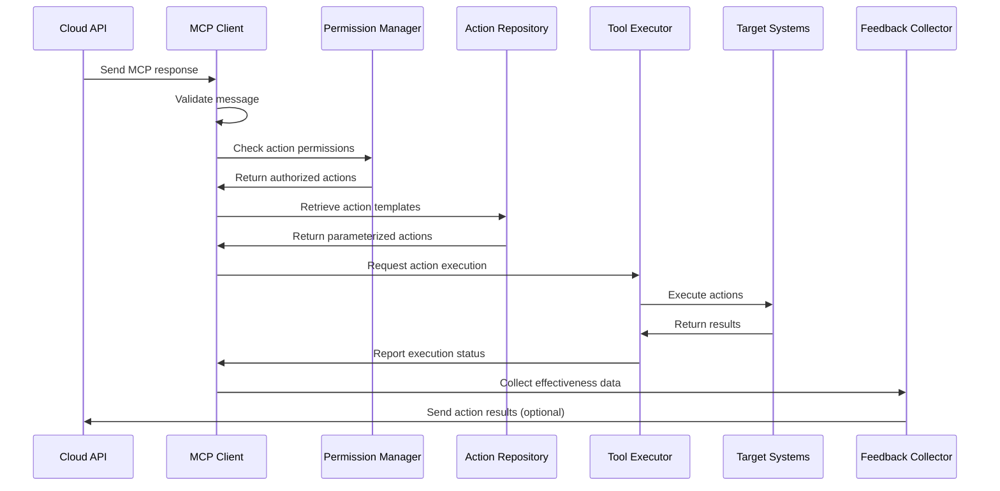

### Key Steps

1. **Response Processing**
   - MCP client receives structured response
   - Message validated for integrity and authenticity
   - Severity level determines processing priority

2. **Permission Verification**
   - Recommended actions checked against local permission policy
   - Role-based access control determines execution eligibility
   - High-risk actions may require explicit approval

3. **Action Preparation**
   - Action templates retrieved from local repository
   - Templates parameterized with context-specific values
   - Prerequisite checks performed to ensure safe execution

4. **Execution**
   - Authorized actions executed on target systems
   - Actions can include:
     - Service restarts
     - Configuration changes
     - Resource scaling
     - Traffic routing adjustments
     - Notification dispatching
   - Execution logged for audit purposes

5. **Feedback Collection**
   - Action results captured and evaluated
   - Effectiveness measured based on issue resolution
   - Feedback optionally sent to cloud for learning

## 5. Learning & Improvement

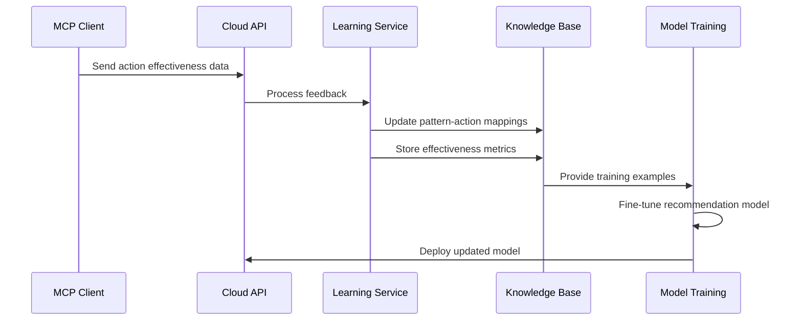

### Key Steps

1. **Feedback Collection**
   - MCP client optionally reports action outcomes
   - Success/failure status captured
   - Resolution time measured
   - System state changes recorded

2. **Knowledge Base Update**
   - Pattern-to-action mappings strengthened or weakened
   - Effectiveness metrics updated
   - New patterns incorporated into knowledge base

3. **Model Improvement**
   - Recommendation models periodically retrained
   - Organization-specific patterns prioritized
   - Industry-wide patterns (anonymized) incorporated

## Specialized Workflows

### A. Alert Notification Workflow

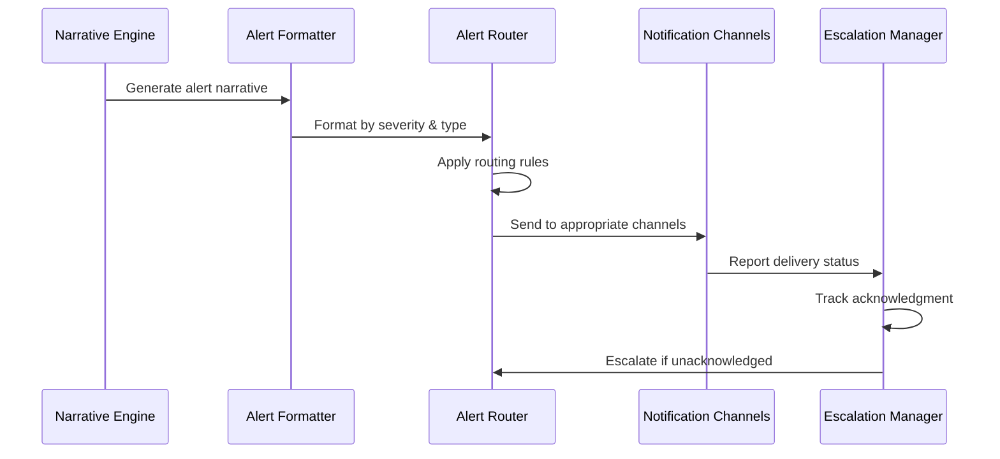

### B. Compliance Reporting Workflow

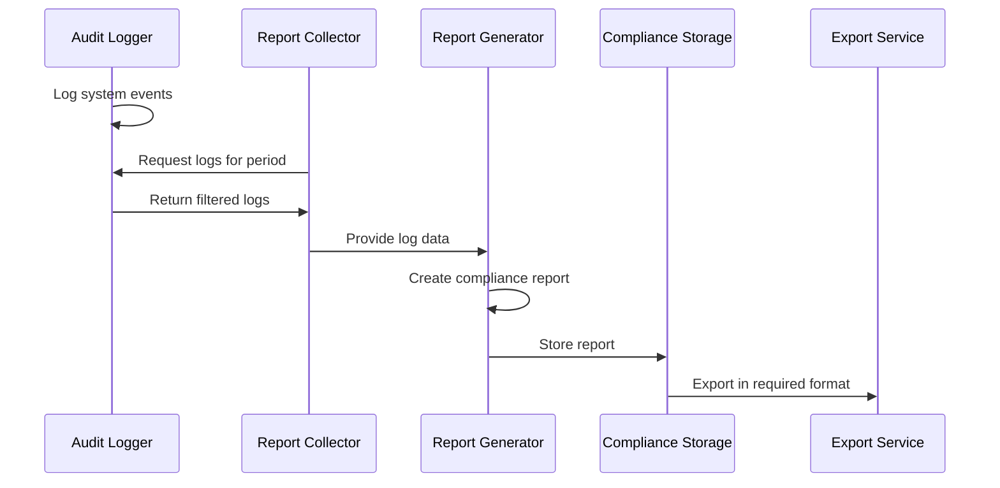

### C. Deployment Update Workflow

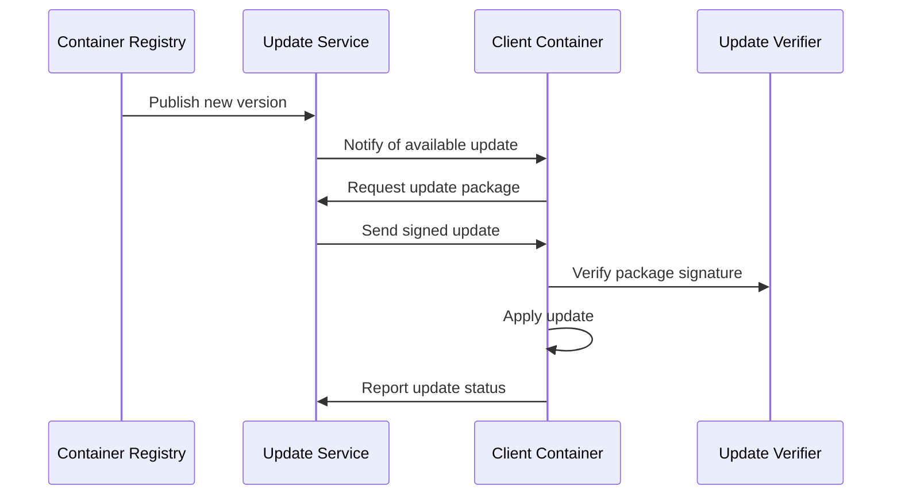

## Error Handling Workflows

### Connection Failure Recovery

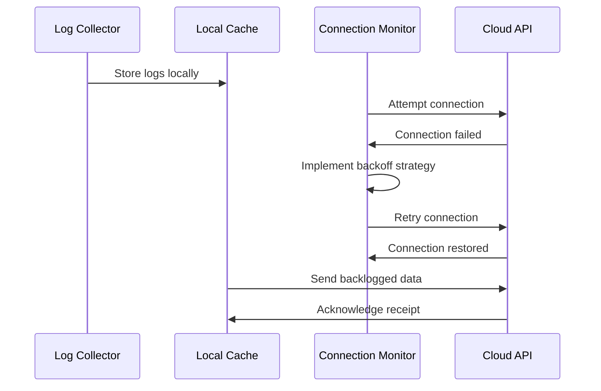

### Action Execution Failure

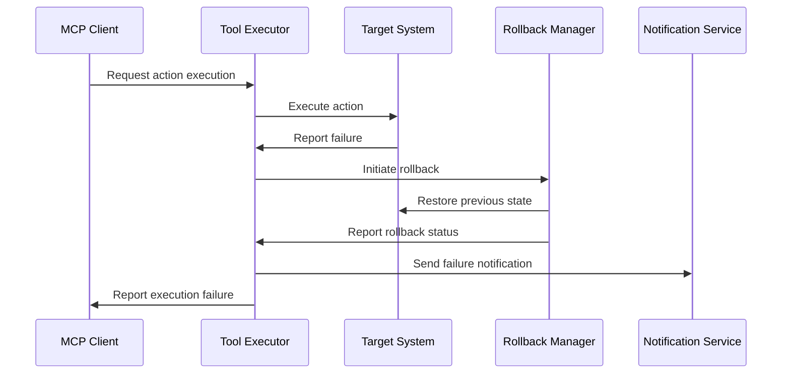

## User Interaction Workflows

### Interactive Troubleshooting

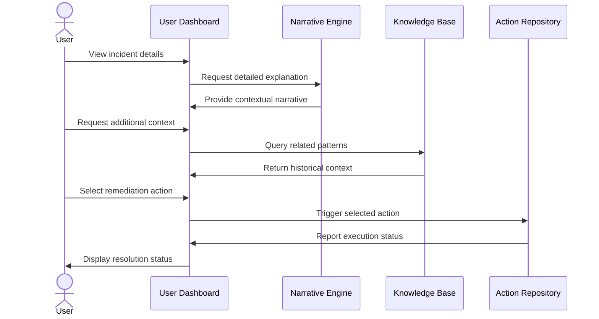

### Custom Rule Creation

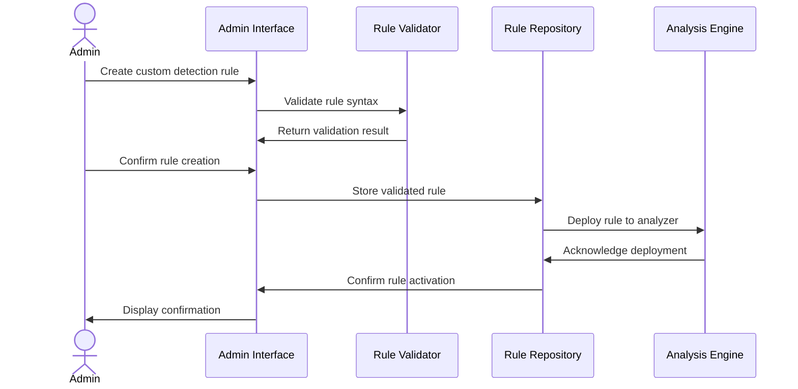

## Integration Workflows

### Third-Party Tool Integration

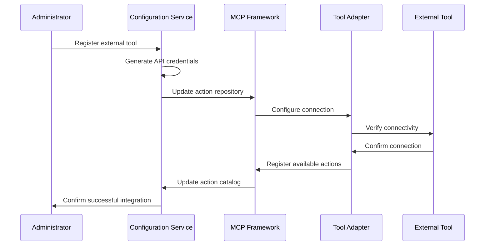

### Data Source Integration

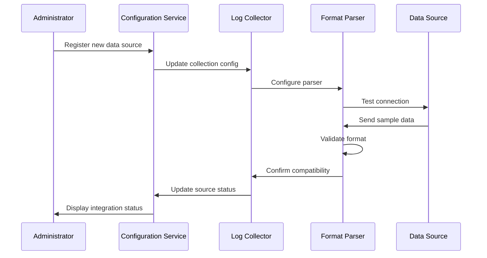

## Maintenance Workflows

### Routine Health Check

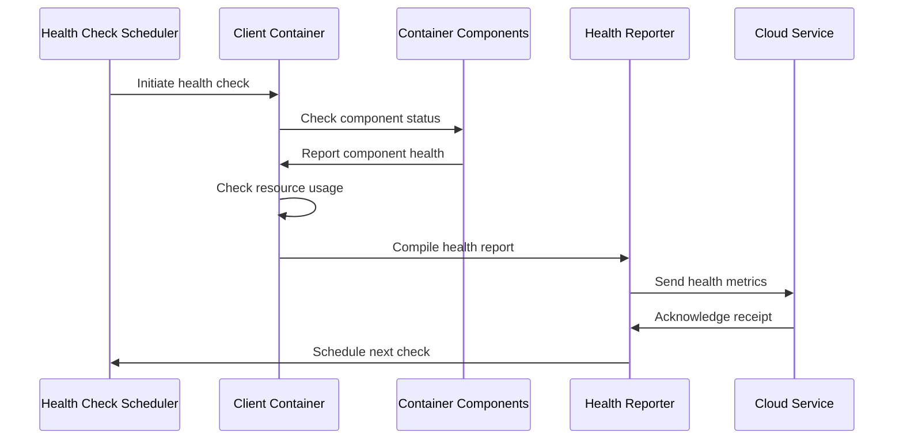

### System Backup

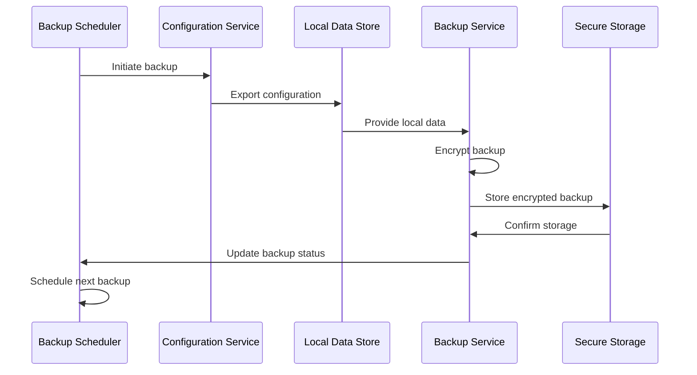

## Workflow Integration

These workflows do not operate in isolation but form an integrated system where outputs from one workflow become inputs to another. The system maintains state across workflows to ensure consistency and continuity of operations.

### Key Integration Points

1. **Log Collection → Analysis**: Encrypted logs flow from collection to analysis
2. **Analysis → Action**: Analysis results drive automated actions
3. **Action → Learning**: Action outcomes inform future recommendations
4. **Learning → Analysis**: Improved models enhance future analysis

This closed-loop system enables continuous improvement over time, with each component benefiting from the outputs of others.
